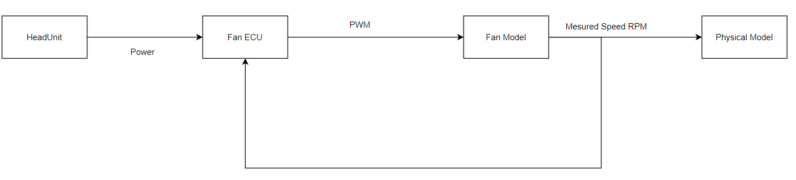

# FanControl ECU Description

The FanControl ECU has one SWC that converts the power that it has as in input to a Desired Fan Speed, then based on this value it generates a PWM signal that gives to a simulated fan Model.

This Fan Model developed with CAPL, is turned on and off based on PWM duty cycle, thus generates rotation, the measured fan speed is then given back to the FanControl through a PropotionalIntegrator regulator so that the ECU can generate a more accurate PWM Signal to achieve the Desired Fan Speed

This ECU is able to detect if the fan model is faulty (either it's not working at all, or it's not responsive/stuck) this information is then communicated back to the system to stop allocating power to the faulty fan

<div class="archi-image" align="center">
     
</div>


# Build using VTT 7 or newer

Execute the following command to build the Fan Control ECU as VTT DLL:

```powershell
& 'C:\Program Files\Vector vVIRTUALtarget 7\Exec64\VttMake.exe' make .\Integration\FanControlECU\FanControl_VTT\FanControl.vttmake
```

# Build using VTT 6 or older

<br>To build the SUT using VTT versions 6 and older, disable (comment) `<GenerateRte />` and `<GenerateBsw />` run following commands in PowerShell:
```powershell
cd FanControlECU\FanControl_VTT;
$DVCfgCmd = "..\..\VTT.SIP.ASR4.R29\DaVinciConfigurator\Core\DVCfgCmd.exe"
& $DVCfgCmd -p ..\FanControl_ECU\FanControl.dpa --generate --saveProject --syncSystemDescription --genType VTT --reportFile ..\FanControl_ECU\Log\GenerateAll.xml
vttmake make .\FanControl.vttmake
```

__INFO__: DaVinci Configurator has to be called independently of vttmake because of the known `-n` issue with the VTT.SIP.ASR4.R29. This issue will be fixed with VTT 7 and then the BSW and RTE can be built using vttmake. 
